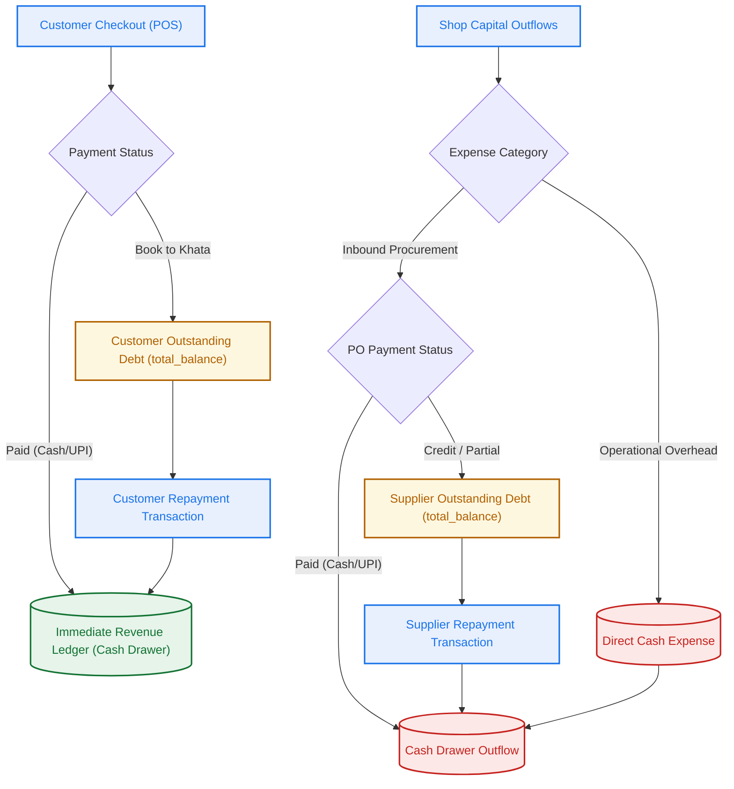

# LalaKirana: Money Flow and Financial Accountability Guide

LalaKirana implements an audit-compliant, transaction-secure, double-entry financial system. To prevent inventory leakage, register deficits, or debt calculation errors, all transaction operations are handled atomically via PostgreSQL Stored Procedures (RPCs).

---

## 1. High-Level Financial Topology

The shop's financial model is divided into three components: **Inward Flows** (direct POS sales and credit collections), **Outward Flows** (stock purchases, supplier repayments, and operational expenses), and **EOD Reconciliation** (balancing physical cash against database expectations).



---

## 2. Inward Money Flow (POS Sales & Customer Ledgers)

All consumer-facing transactions flow through the POS billing system. 

### A. Core Billing Schemas

* **`bills`**: Tracks each transaction header. Key fields:
  * `mode`: `'full'` (itemized stock checkout) or `'quick'` (cash register lump-sum override).
  * `status`: `'draft'` (temporary slot), `'paid'` (cash/UPI received), `'khata'` (unpaid debt booked to customer), or `'cancelled'`.
  * `total`: Calculated sum of items (GST/taxes are MRP-inclusive).
* **`bill_items`**: Tracks product quantities, unit prices, and cost prices at the moment of sale to lock in profit margin analytics regardless of future pricing changes.
* **`khata_entries`**: Ledger table documenting change.
  * `type = 'purchase'`: Increments outstanding debt.
  * `type = 'payment'`: Decrements outstanding debt.
  * `is_deleted`: Soft-delete flag (recalculated if a cancellation occurs).

### B. Transaction Workflows

#### 1. Atomic POS Checkout (`confirm_bill_transaction`)
When a cashier clicks "Pay" or "Book to Khata", a single database transaction handles the checkout to prevent race conditions (such as double-selling stock):

```sql
SELECT stock_qty FROM products WHERE id = v_product_id FOR UPDATE;
-- Locks product rows to prevent concurrent checkout conflicts.
-- Deducts stock: stock_qty = stock_qty - v_qty
-- Inserts bill_items and logs stock movement (reason = 'bill_confirm')
```
* **If Status is `'paid'`**: The cash drawer expected balance is updated immediately. No customer record is mandatory.
* **If Status is `'khata'`**: The customer account is locked (`FOR UPDATE`). A `khata_entries` row of type `'purchase'` is added, and the customer's `total_balance` is incremented.

#### 2. Atomic Bill Cancellation (`cancel_bill_transaction`)
Only store `owners` can cancel confirmed bills. Cancelling triggers an atomic restoration script:
* Reverts bill status to `'cancelled'`.
* Restores item quantities back to product stock logs (`reason = 'bill_cancel'`).
* **If Khata Bill**: Customer balance is locked, the original `khata_entries` row is soft-deleted (`is_deleted = TRUE`), and the customer's `total_balance` is decremented (clamped to $\ge 0$).

#### 3. Customer Repayments (`log_repayment_transaction`)
When a credit customer returns to pay down their tab:
* Checks that the repayment amount does not exceed their current outstanding balance (`total_balance`).
* Inserts a record in `khata_entries` (`type = 'payment'`, `amount = repayment_amount`).
* Atomically decrements the customer's `total_balance` on `customers`.
* Registers a cash inflow in the daily system drawer balance.

---

## 3. Outward Money Flow (Procurement & Expenses)

Outward flows represent cash or credit allocated to acquire inventory or pay operational overhead.

### A. Procurement and Supplier ledgers

* **`suppliers`**: Tracks name, contact details, and their `total_balance` (the outstanding debt the shop owes this supplier).
* **`purchase_orders`**: Procurement transaction headers, carrying `payment_status` (`'paid'`, `'credit'`, or `'partial'`).
* **`purchase_order_items`**: Stores item count, cost price, and retail selling price. Features `previous_cost` and `previous_sell` snapshots to revert to original valuations if the order is cancelled.

### B. Transaction Workflows

#### 1. Purchase Order Confirmation (`confirm_purchase_order_transaction`)
Triggered during inbound stock logs:
* Sums total cost (`qty * cost_price`) across items.
* Updates product catalog parameters: increments `stock_qty`, updates `cost_price` to the new wholesale rate, and optionally updates `price` (retail price) if specified. Logs stock movement (`reason = 'purchase_order'`).
* **If credit/partial**: Locks the supplier record and increments the supplier's `total_balance` by the unpaid portion (`total - amount_paid`).

#### 2. Purchase Order Cancellation (`cancel_purchase_order_transaction`)
If a delivery is rejected or logged in error:
* Deducts the received items from product stock logs (`reason = 'purchase_cancel'`).
* Reverts product `cost_price` and retail `price` back to their snapshot states (`previous_cost` / `previous_sell`).
* Subtracts the unpaid portion of the PO from the supplier's outstanding `total_balance`.

#### 3. Supplier Repayments (`log_supplier_repayment_transaction`)
When the shop pays a supplier to settle accounts:
* Creates a transaction entry in `supplier_repayments`.
* Decrements the supplier's outstanding `total_balance` on `suppliers`.
* Decrements the cash register expectations.

### C. Direct Operational Expenses
Logged in the `expenses` table. These represent immediate cash outflows that bypass inventory (e.g., utility bills, packaging, rent, transport, or shop maintenance). Every expense decrements the cash drawer's EOD expectations.

---

## 4. End-of-Day (EOD) Accountability & Reconciliations

Accountability focuses on validating inventory levels and physical cash holdings to detect theft, billing omissions, or cash leakage.

### A. The Core Cash Reconciliation Model

The theoretical cash register balance at any given moment is calculated using the following mathematical model:

$$\text{Expected Cash} = \text{Opening Cash} + \text{Cash Sales (Paid Bills)} + \text{Khata Repayments} - \text{Cash Purchases (Paid POs)} - \text{Supplier Repayments} - \text{Expenses}$$

To audit a cashier, the owner counts the physical cash at closing:

$$\text{Discrepancy} = \text{Physical Cash Count} - \text{Expected Cash}$$

* **$\text{Discrepancy} = 0$**: Balanced.
* **$\text{Discrepancy} < 0$**: **Cash Short** (indicating drawer leakage, theft, or missed bill logs).
* **$\text{Discrepancy} > 0$**: **Cash Over** (indicating customer overpayment or failure to record cash expenses).

### B. Daily Sales Diary (EOD) Sync

Because POS counter checkouts can be slow during rush hours, the shopkeeper can record sales on a paper ledger and digitize it at closing:
* **Entry**: `POST /api/v1/inventory/eod` contains a target date and an array of `{ product_id, qty_sold }`.
* **Stock Recalculation**: The system subtracts the sold quantities from `products.stock_qty` and inserts entries into `eod_entries`.
* **Correction Delta**: If a log is edited, the backend calculates the difference:
  $$\Delta = \text{new\_qty} - \text{old\_qty}$$
  The stock is adjusted by subtracting $\Delta$. (If $\Delta$ is negative, stock is restored; if positive, additional stock is deducted).
* **Reset/Clear Log**: If an entry or item is cleared, the system removes the database row and restores the original stock quantity back to the inventory (`reason = 'eod_entry'`, note: `"EOD sales entry removed"`).

---

## 5. Profitability & Margin Accountability

All revenue and cost items aggregate into the analytics dashboard (`backend/src/features/analytics/analytics.service.ts`):

* **Revenue**: Calculated as:
  $$\text{Revenue} = \sum (\text{Bill Item Qty} \times \text{Unit Price}) + \sum (\text{Quick Bill Totals}) + \sum (\text{EOD Qty} \times \text{Product Price})$$
* **Wholesale Cost**: Calculated as:
  $$\text{Cost} = \sum (\text{Bill Item Qty} \times \text{Cost Price}) + \sum (\text{EOD Qty} \times \text{Cost Price})$$
* **Net Margin**: Calculated as:
  $$\text{Profit Margin} = \frac{\text{Revenue} - \text{Cost}}{\text{Revenue}} \times 100\%$$
* **Price Age Warning System**: To secure these margins on volatile grocery commodities (such as ghee, oils, dals, grains), the frontend monitors the price log timestamps (`price_history` table). If a category item has not had a price audit or update within 24 hours, the dashboard displays a warning flag (`⚠️ Price outdated`) to prevent sales at outdated cost rates.
