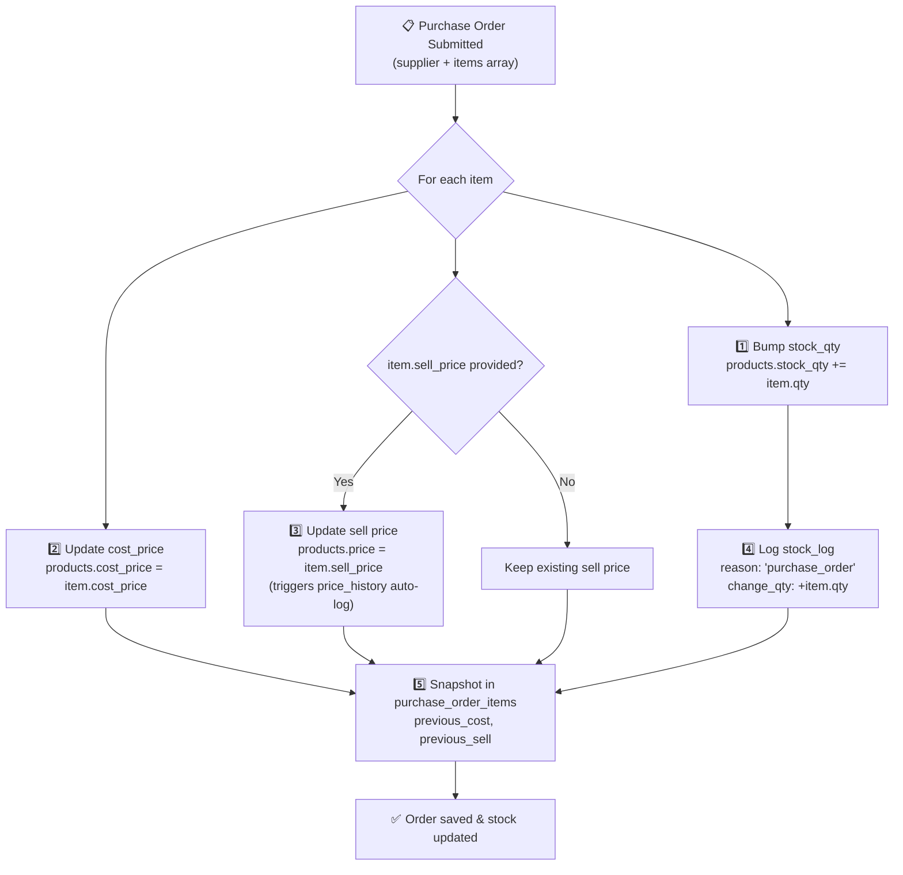
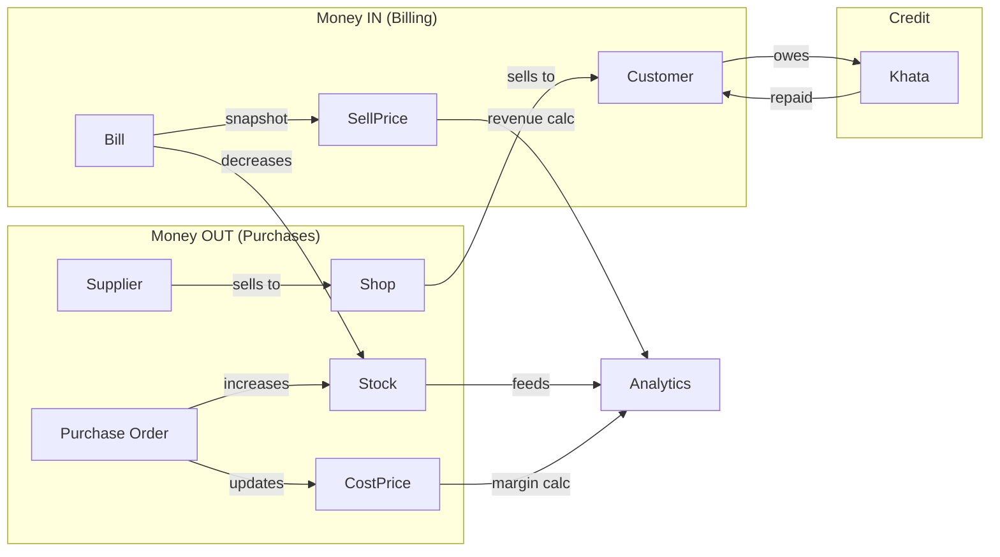

# Purchase Orders (Stock-In) & Item History — Design Discussion

## 🧠 The Real-World Problem

In a kirana shop, the workflow looks like this:

```
Seller arrives at shop → hands paper bill → shopkeeper counts items
→ pays cash or notes in khata → stacks items on shelf

Later (or same time): shopkeeper enters this into the system
```

**What we need to digitize:**
1. **Who sold it** — Seller/supplier name & details
2. **What items** — Multiple products in one purchase
3. **At what price** — Cost price (what we paid) + new sell price (if changed)
4. **How many** — Quantities received → stock goes up
5. **When** — Date of purchase (may be backdated if entered later)

**And for Item History, we need to answer:**
- *"Who was the last person who sold us this turmeric?"*
- *"What was the cost price 2 months ago?"*
- *"What's our margin on this item over time?"*

---

## 📊 Current Schema — What Exists vs What's Missing

### ✅ Already Exists
| What | Where | How it helps |
|:-----|:------|:-------------|
| `products.cost_price` | [003](file:///c:/MANAS/Projects/LK/Implementation/migrations/003_create_products.sql) + [018](file:///c:/MANAS/Projects/LK/Implementation/migrations/018_add_cost_price.sql) | Stores current purchase cost |
| `products.stock_qty` | [003](file:///c:/MANAS/Projects/LK/Implementation/migrations/003_create_products.sql) | Current stock level |
| `price_history` | [010](file:///c:/MANAS/Projects/LK/Implementation/migrations/010_create_price_history.sql) | Logs sell price changes (auto-trigger) |
| `stock_log` | [004](file:///c:/MANAS/Projects/LK/Implementation/migrations/004_create_stock_log.sql) | Audit trail of stock movements |

### ❌ Missing — Needs New Tables
| What | Why |
|:-----|:----|
| **Suppliers** | No concept of "who sold us this item" |
| **Purchase Orders** | No way to group a seller's bill as one transaction |
| **Purchase Items** | No link between a purchase event, supplier, product, and cost |

---

## 🏗️ Proposed Database Design

### New Table: `suppliers`

```sql
CREATE TABLE suppliers (
  id          UUID PRIMARY KEY DEFAULT gen_random_uuid(),
  name        TEXT NOT NULL,
  phone       TEXT,
  address     TEXT,
  note        TEXT,                    -- "Comes every Tuesday", "Wholesaler from Indore"
  is_active   BOOLEAN NOT NULL DEFAULT true,
  created_at  TIMESTAMPTZ NOT NULL DEFAULT now()
);
```

> Lightweight table. A kirana shop typically deals with 10-30 regular suppliers.

---

### New Table: `purchase_orders` (the header/bill)

```sql
CREATE TABLE purchase_orders (
  id              UUID PRIMARY KEY DEFAULT gen_random_uuid(),
  supplier_id     UUID REFERENCES suppliers(id) ON DELETE SET NULL,
  supplier_name   TEXT NOT NULL,         -- snapshot (in case supplier is deleted later)
  order_date      DATE NOT NULL DEFAULT CURRENT_DATE,
  -- can be backdated (entered later from paper bill)
  reference_number TEXT,                 -- seller's bill number from paper
  total           NUMERIC(10,2) NOT NULL DEFAULT 0,
  item_count      INTEGER NOT NULL DEFAULT 0,
  note            TEXT,
  status          TEXT NOT NULL DEFAULT 'confirmed',
  -- 'confirmed' | 'cancelled'
  created_by      UUID REFERENCES users(id) ON DELETE SET NULL,
  created_at      TIMESTAMPTZ NOT NULL DEFAULT now()
);
```

> [!TIP]
> `reference_number` is the **seller's bill number** from their paper receipt. This makes it easy to match offline bills with digital records later.

---

### New Table: `purchase_order_items` (the line items)

```sql
CREATE TABLE purchase_order_items (
  id                UUID PRIMARY KEY DEFAULT gen_random_uuid(),
  purchase_order_id UUID NOT NULL REFERENCES purchase_orders(id) ON DELETE CASCADE,
  product_id        UUID NOT NULL REFERENCES products(id) ON DELETE CASCADE,
  product_name      TEXT NOT NULL,         -- snapshot at time of entry
  qty               INTEGER NOT NULL CHECK (qty > 0),
  cost_price        NUMERIC(10,2) NOT NULL CHECK (cost_price >= 0),
  -- what we PAID the seller per unit
  sell_price        NUMERIC(10,2),
  -- optional: new MRP/sell price (if seller gave updated MRP)
  -- NULL = keep existing sell price unchanged
  previous_cost     NUMERIC(10,2),
  -- snapshot of product's cost_price BEFORE this purchase
  previous_sell     NUMERIC(10,2)
  -- snapshot of product's price BEFORE this purchase
);
```

> [!IMPORTANT]
> Each line item snapshots the **before** and **after** prices. This gives us a complete audit trail without needing complex joins.

---

## ⚡ How It All Connects — The Confirmation Flow

When a purchase order is confirmed, the backend performs these **atomic side-effects** in a single transaction:



### Side-effects summary per item:

| Action | Table | What changes |
|:-------|:------|:-------------|
| Stock increases | `products` | `stock_qty += qty` |
| Cost price updates | `products` | `cost_price = new cost_price` |
| Sell price updates (optional) | `products` | `price = new sell_price` → auto-triggers `price_history` |
| Stock audit logged | `stock_log` | `reason: 'purchase_order'`, `change_qty: +qty` |
| Snapshots frozen | `purchase_order_items` | `previous_cost`, `previous_sell` saved |

> [!NOTE]
> We need to add `'purchase_order'` to the `stock_log.reason` enum. Currently it has: `bill_confirm | eod_entry | manual_adjust | damage | audit | returned`.

---

## 🖥️ Frontend — Purchase Entry UI

### Feature: `features/purchases/`

```
features/purchases/
├── PurchasesPage.tsx           ← list of past purchase orders
├── NewPurchaseForm.tsx         ← the bulk entry form
├── PurchaseItemRow.tsx         ← single item row in form
├── PurchaseDetail.tsx          ← view a completed purchase order
├── SupplierSelect.tsx          ← autocomplete + "add new" inline
└── purchases.api.ts            ← API client
```

### New Purchase Form — How it works:

```
┌─────────────────────────────────────────────────────────┐
│  📦 New Purchase Order                                  │
│                                                         │
│  Supplier: [🔍 Ramesh Traders      ▼] [+ New Supplier]  │
│  Date:     [22/06/2026]  Bill Ref: [RT-2026-0421]       │
│                                                         │
│  ┌──────────────────────────────────────────────────────┐│
│  │ Product         Qty   Cost₹  Sell₹  Margin  Action  ││
│  │─────────────────────────────────────────────────────── │
│  │ Turmeric 200g    10   42.00  48.00  12.5%    ✕      ││
│  │ Basmati 1kg       5  105.00 120.00  12.5%    ✕      ││
│  │ Tata Tea 250g    12   82.00  95.00  13.7%    ✕      ││
│  │ [🔍 Search product to add...]           [+ Add Row] ││
│  └──────────────────────────────────────────────────────┘│
│                                                         │
│  Items: 3 │ Total Cost: ₹2,114.00 │ Est. Revenue: ₹2,435│
│  Est. Profit: ₹321.00 (15.2%)                          │
│                                                         │
│  Note: [Monthly restock - oils & grains          ]      │
│                                                         │
│  [Cancel]                    [Save Purchase Order ✓]    │
│                                                         │
└─────────────────────────────────────────────────────────┘
```

### Key UX behaviors:
1. **Product search** — Same search-as-you-type used in billing, but here it auto-fills the current `cost_price` and `price` from the DB
2. **Margin auto-calc** — As user types cost/sell, margin % updates live: `margin = ((sell - cost) / sell) * 100`
3. **Sell price is optional** — If left blank, existing MRP stays. Only fill if seller gave a new MRP
4. **Supplier autocomplete** — Type to search existing suppliers, or create new inline
5. **Backdating** — Date picker defaults to today but can go back (for entering yesterday's paper bill)

---

## 📖 Item History — Product Detail Enhancement

This isn't a new page — it **enhances the existing product detail view** in the Inventory page.

### What to show for each product:

```
┌─────────────────────────────────────────────────────────┐
│  📦 Turmeric 200g                         Category: Spices│
│  Current: ₹48.00 (sell) │ ₹42.00 (cost) │ Margin: 12.5% │
│  Stock: 34 pcs │ Low stock alert: 5                      │
│                                                          │
│  ┌─── Tabs ──────────────────────────────────────────── ┐│
│  │ [Price History]  [Stock Log]  [Supplier History] 🆕  ││
│  └──────────────────────────────────────────────────────┘│
│                                                          │
│  ── Supplier History ─────────────────────────────────── │
│                                                          │
│  │ Date       │ Supplier        │ Qty │ Cost₹ │ Sell₹ │ │
│  │────────────│─────────────────│─────│───────│───────│ │
│  │ 22 Jun '26 │ Ramesh Traders  │  10 │ 42.00 │ 48.00 │ │
│  │ 15 Jun '26 │ Ramesh Traders  │   8 │ 40.00 │ 46.00 │ │
│  │ 01 Jun '26 │ Gupta Wholesale │  15 │ 38.50 │ 45.00 │ │
│  │ 20 May '26 │ Ramesh Traders  │  10 │ 40.00 │ 46.00 │ │
│                                                          │
│  📊 Cost Price Trend (last 3 months)                     │
│  ┌──────────────────────────────────────────────────────┐│
│  │       42 ─ ─ ─ ─ ─ ─ ─ ─ ─ ─ ─ ─ ─ ─ ─ ─ ─ ●     ││
│  │       40 ─ ─ ─ ─ ─ ● ─ ─ ─ ─ ─ ─ ─ ●              ││
│  │   ₹   38 ─ ● ─ ─ ─                                  ││
│  │       36 ─                                           ││
│  │         May          Jun                              ││
│  └──────────────────────────────────────────────────────┘│
│                                                          │
│  🏷️ Supplier Summary                                    │
│  ┌──────────────────────────────────────────────────────┐│
│  │ Ramesh Traders   │ 3 orders │ Last: ₹42/unit │ 70%  ││
│  │ Gupta Wholesale  │ 1 order  │ Last: ₹38.5    │ 30%  ││
│  └──────────────────────────────────────────────────────┘│
└─────────────────────────────────────────────────────────┘
```

### What "Item History" answers at a glance:

| Question | Where the answer comes from |
|:---------|:---------------------------|
| Who last sold us this? | `purchase_order_items` → `purchase_orders.supplier_name` |
| What was the cost price X weeks ago? | `purchase_order_items.cost_price` ordered by date |
| Is the cost going up or down? | Cost price trend chart from purchase history |
| What's our current margin? | `((price - cost_price) / price) * 100` live calc |
| Which supplier gives better rates? | Group by supplier → avg cost price comparison |
| How often do we restock this? | Count of purchase orders containing this product |

---

## 🔗 Integration with Existing Systems

### 1. Stock Log Enhancement
Add `'purchase_order'` as a new reason to [stock_log](file:///c:/MANAS/Projects/LK/Implementation/migrations/004_create_stock_log.sql):

```diff
 -- reason: 'bill_confirm' | 'eod_entry' | 'manual_adjust' | 'damage' | 'audit' | 'returned'
+-- Adding: 'purchase_order'
```

Also add a `purchase_order_id` reference column to `stock_log` (similar to how `bill_id` already exists).

### 2. Price History — Already Handled
When a purchase order updates `products.price` (sell price), the existing DB trigger `trg_log_price_change` in [migration 010](file:///c:/MANAS/Projects/LK/Implementation/migrations/010_create_price_history.sql) **automatically logs it** to `price_history`. No extra code needed!

### 3. Analytics Impact
Purchase data feeds into analytics:
- **Cost of goods sold** can now be precise (actual cost_price from purchase, not estimated 95%)
- **Margin analytics** become real
- **Stock turnover** can be calculated (purchase qty vs sales qty over time)

### 4. Dashboard Enhancement
- **"Recent Purchases"** widget showing last 5 purchase orders
- **"Top Suppliers"** quick stat

---

## 🔀 How This Relates to Phase 2 (Billing + Khata)



> [!IMPORTANT]
> **Purchase Orders and Billing are mirror features.** Purchases = money going out, stock coming in. Bills = money coming in, stock going out. Building them together gives you a **complete cash flow picture.**

---

## 🤔 Open Questions

### 1. Supplier Credit / Khata
- Do you ever owe money to suppliers (buy on credit)?
- If yes, should we track "Supplier Khata" similar to customer Khata?
- Or is payment always immediate (cash on delivery)?

### 2. Purchase Order Status
- Should we support `'draft'` purchase orders (entered but not confirmed)?
- Or are purchases always entered after they've already happened (confirmed on save)?

### 3. Where in Navigation?
- Separate sidebar item **"Purchases"** with its own icon?
- Under **"Inventory"** as a sub-section?
- Recommendation: Separate — it's a major workflow

### 4. Item History Location
- **Option A:** New tab inside the existing product detail modal on the Inventory page
- **Option B:** Separate "Product Intelligence" page with deeper analytics
- Recommendation: Option A (keeps product info centralized)

### 5. Purchase Returns
- If items are defective, should there be a "Return to Supplier" flow?
- This would decrease stock and create a negative purchase entry
- Defer to later phase?

### 6. Multiple Suppliers per Product
- Can the same product (e.g., Turmeric 200g) come from different suppliers?
- (Almost certainly yes in kirana reality — this is handled by the design above)

---

## 📐 Proposed API Endpoints

### Suppliers
| Endpoint | Method | Description |
|:---------|:-------|:------------|
| `/api/v1/suppliers` | GET | List suppliers (search by name) |
| `/api/v1/suppliers` | POST | Create new supplier |
| `/api/v1/suppliers/:id` | PUT | Update supplier details |

### Purchase Orders
| Endpoint | Method | Description |
|:---------|:-------|:------------|
| `/api/v1/purchases` | POST | Create & confirm purchase order (bulk stock-in) |
| `/api/v1/purchases` | GET | List purchase orders (filter by date, supplier) |
| `/api/v1/purchases/:id` | GET | Get single order with items |
| `/api/v1/purchases/:id/cancel` | POST | Cancel order, reverse stock changes |

### Item History (extends existing products)
| Endpoint | Method | Description |
|:---------|:-------|:------------|
| `/api/v1/products/:id/purchase-history` | GET | All purchase entries for this product |
| `/api/v1/products/:id/supplier-summary` | GET | Grouped supplier stats for this product |

---

## 🏗️ Build Estimate

| Component | Effort | Dependencies |
|:----------|:-------|:-------------|
| Migration: suppliers + purchase tables | Small | None |
| Backend: Suppliers CRUD | Small | Migration |
| Backend: Purchase order service (the core logic) | Medium | Migration + stock_log update |
| Frontend: Purchase form (the big one) | Medium-Large | Backend APIs + product search reuse |
| Frontend: Item history tab | Medium | Backend purchase-history endpoint |
| Frontend: Supplier autocomplete | Small | Suppliers API |
| Integration tests | Medium | All backend |

> [!TIP]
> **Efficiency win:** The purchase form's product search can **reuse the same search component** from the Billing page. Build Billing first → Purchase form gets product search for free.
